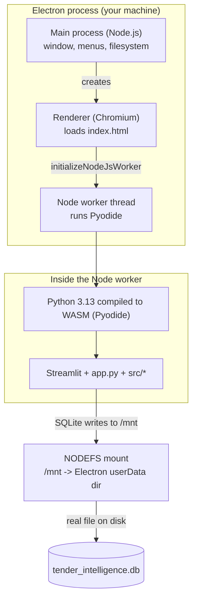
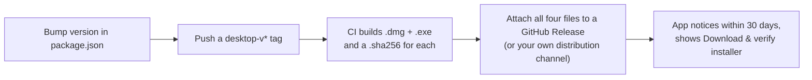

# Desktop App: Build, Release & Update Guide

A practical guide to how the desktop packaging works, how to produce a `.exe`/`.dmg`, and
how a new version actually reaches a user's machine. For day-to-day usage instructions
(importing reports, running analyses) see `README.md`. This file is about packaging and
distribution only.

## 1. How it works

The desktop app is the same `app.py` and `src/` code that runs under `streamlit run`, just
executed by a different Python runtime and shipped inside a native shell instead of served
over HTTP.



- **No server.** There's no `localhost:8501`, no Streamlit server process, no browser
  round trip. Python runs inside the app itself.
- **No browser storage.** Server mode's IndexedDB shuttle (`src/browser_sync.py`,
  `sync_to_browser()`) doesn't run here — `src/persistence.py`'s `IS_WASM` flag routes
  around it entirely. See the "Persistence model" section of `README.md`.
- **The database is a real file.** `package.json`'s `stlite.desktop.nodefsMountpoints`
  mounts Electron's per-app `userData` folder onto the Pyodide virtual filesystem at
  `/mnt`. `resolve_data_dir()` in `src/persistence.py` points the database there, so every
  write already lands on disk — no explicit flush needed (unlike the IDBFS fallback path,
  which would need one).
- **Python packages come from Pyodide's package manager (`micropip`), not `pip`.** This is
  a materially different resolver from `requirements.txt`'s — see "Known packaging
  constraints" in `README.md` before touching `stlite.desktop.dependencies`.

## 2. How to build a `.exe` / `.dmg`

### Locally (one platform only)

electron-builder cannot reliably cross-build a Windows installer from macOS, or a macOS
installer from Windows/Linux. Building locally only produces an installer for **the OS
you're running the build on**.

Prerequisites: Node.js 20+ (this repo has been built and run with Node 22) and npm.

```bash
npm install                 # once, or after package.json changes
npm run dump                # bundles app.py, src/, master_data/*.xls, and Python deps
                             #   into build/ — this is the slow step (downloads Pyodide
                             #   + package wheels the first time)
npm run app:dist            # packages build/ into an installer, written to dist/
```

- On macOS this produces `dist/*.dmg`.
- On Windows this produces `dist/*.exe` (NSIS installer).
- `npm run app:dir` (instead of `app:dist`) produces an unpacked app directory without
  building the installer — faster, useful for a quick smoke test.
- `npm run dump && npm run serve` launches the app directly via Electron without packaging
  anything — the fastest inner loop for checking a code change actually works before
  spending time on a full installer build.

Rebuild `npm run dump` after **any** change to `app.py`, `src/*.py`,
`master_data/*.xls`, or `stlite.desktop.dependencies` — it's a snapshot, not a live mount.

### Via CI (both platforms, the actual release path)

`.github/workflows/desktop-build.yml` builds both installers in parallel on
`macos-latest` and `windows-latest` and uploads them as workflow artifacts. This is the
only way to get a Windows `.exe` if you're developing on a Mac (or vice versa).

Trigger it either way:

- **Manually**: GitHub → Actions tab → "Desktop build" → *Run workflow*.
- **By pushing a tag** matching `desktop-v*`, e.g.:

  ```bash
  git tag desktop-v0.1.0
  git push origin desktop-v0.1.0
  ```

Either way, once the run finishes, download `tender-intelligence-mac` and
`tender-intelligence-windows` from the run's **Artifacts** section — these are zip files
containing the `.dmg` and `.exe` respectively.

## 3. Releasing a new version to users

**Current state: no silent auto-install, but the app checks and fetches one itself.**
Nothing installs a new version automatically — that needs a signed installer (see
"Adding auto-update" below), which this project doesn't have yet. What *does* exist: the
desktop build silently checks for a new release in the background at most once every 30
days (`app.py`'s `maybe_check_for_updates_in_background`, cadence persisted in a small
`update_check_state.json` next to the database so it survives app restarts). Being
up-to-date or a failed check (offline, GitHub hiccup) is invisible — nothing appears in
either case. Only when a newer version is genuinely available does an "Update available"
banner and a **"Download & verify installer"** button appear below the masthead, which
downloads and SHA256-verifies the installer in-app before handing it to the user via a
normal browser-style save dialog (`download_and_verify_installer`). The user still has to
quit and run the installer themselves. Their data isn't affected either way — it lives in
the `userData` folder, which reinstalling doesn't touch.



### The manual release process, step by step

1. Bump `"version"` in `package.json` (e.g. `0.1.0` → `0.2.0`). This becomes the
   installer's version number and, on macOS, the `.app` bundle version. The installer
   *filenames* stay fixed (`Tender-Intelligence.dmg`, `Tender-Intelligence-Setup.exe`) via
   `build.mac.artifactName` / `build.win.artifactName` — deliberately version-free so both
   the web app's download button and the desktop app's background update check
   (`app.py`'s `maybe_check_for_updates_in_background`) can link to
   `.../releases/latest/download/<name>`, a permalink that keeps resolving to whatever
   release is newest without any code change.
2. Commit that change, then tag and push:
   ```bash
   git tag desktop-v0.2.0
   git push origin main desktop-v0.2.0
   ```
3. Wait for the `desktop-build` workflow to finish, download both artifacts from the run.
   Each contains the installer *and* a matching `.sha256` file (`npm run checksum`,
   wired into the CI workflow) — the desktop app's update check fetches that file to
   verify the installer it downloads wasn't corrupted or tampered with in transit.
4. Create a GitHub Release (or use whatever channel you distribute through) for that tag,
   and attach all four files: `.dmg`, `.dmg.sha256`, `.exe`, `.exe.sha256`. Skipping the
   `.sha256` files doesn't break the download link, but the in-app verification step will
   report it couldn't confirm the file's integrity.
5. Tell users where to download the new installer, or just wait — every running desktop
   app notices on its own within 30 days and shows the install prompt. They quit the
   running app, install the new version over the old one, and relaunch — their SQLite
   data in `userData` is untouched by the reinstall.

This is fine for a small user base with infrequent releases. It gets tedious fast once you
have more than a handful of users or ship updates often — that's what auto-update solves.

### Adding auto-update (not set up yet — here's what it would take)

If you want the app to check for and install updates itself, the standard approach is
[`electron-updater`](https://www.electron.build/auto-update) reading from GitHub Releases.
Roughly:

1. Add `electron-updater` as a dependency and a few lines in the Electron main process to
   call `autoUpdater.checkForUpdatesAndNotify()` on launch.
2. Add a `publish` block to `package.json`'s `build` config:
   ```json
   "publish": { "provider": "github", "owner": "<org>", "repo": "<repo>" }
   ```
3. Push releases with `electron-builder --publish always` instead of a plain
   `app:dist` — it uploads the installer *and* the update metadata files
   (`latest.yml` / `latest-mac.yml`) electron-updater polls for.

**The real blocker isn't the code, it's code signing.** Both platforms require signed
installers before auto-update — and often before a normal install — will work smoothly:

- **macOS**: needs an Apple Developer ID certificate (Apple Developer Program, $99/yr) and
  notarization. Without it, Gatekeeper blocks the app with "Apple could not verify this app
  is free of malware" and users have to right-click → Open to bypass it manually — auto-update
  can't silently replace a running app under this restriction either.
- **Windows**: needs a code-signing certificate (typically an "EV" cert from a CA,
  a recurring paid cost). Without one, SmartScreen shows an "unrecognized app" warning on
  every install.

None of that can be set up without your accounts/certificates, so it's out of scope for
what's been built so far. If you want to go this route, the practical next step is
deciding whether the signing cost is worth it for your user base — happy to wire up the
`electron-updater` code once that's settled.
